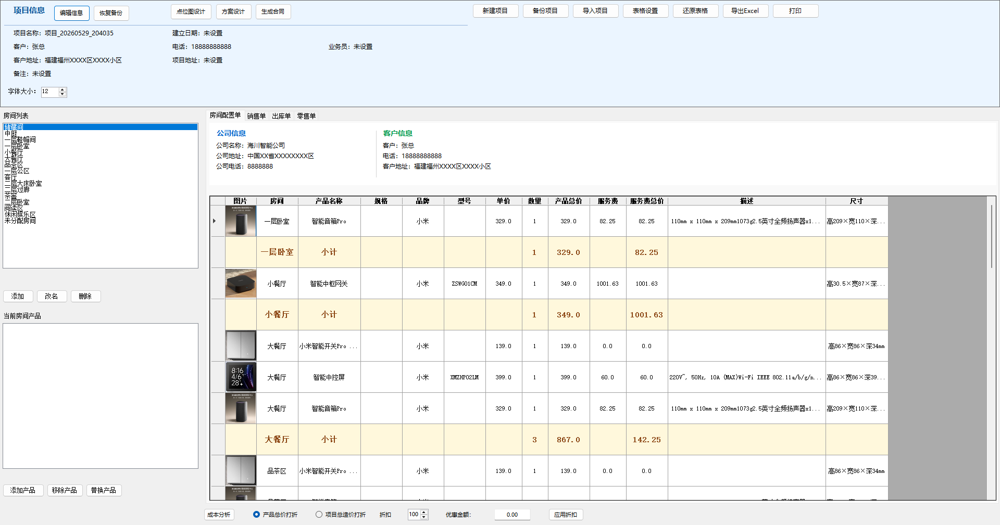
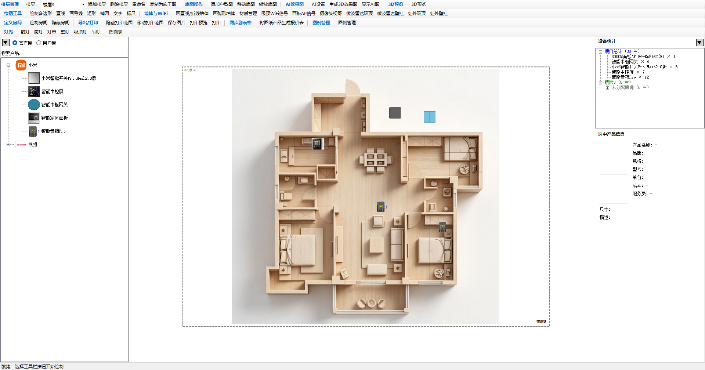
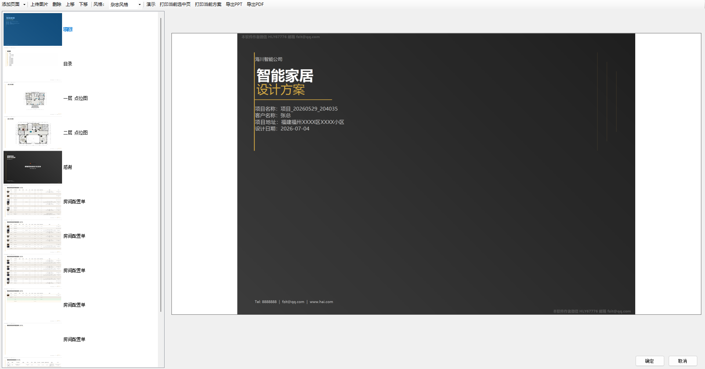
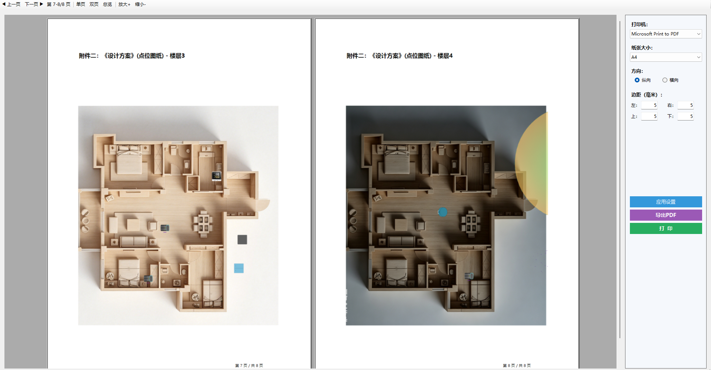
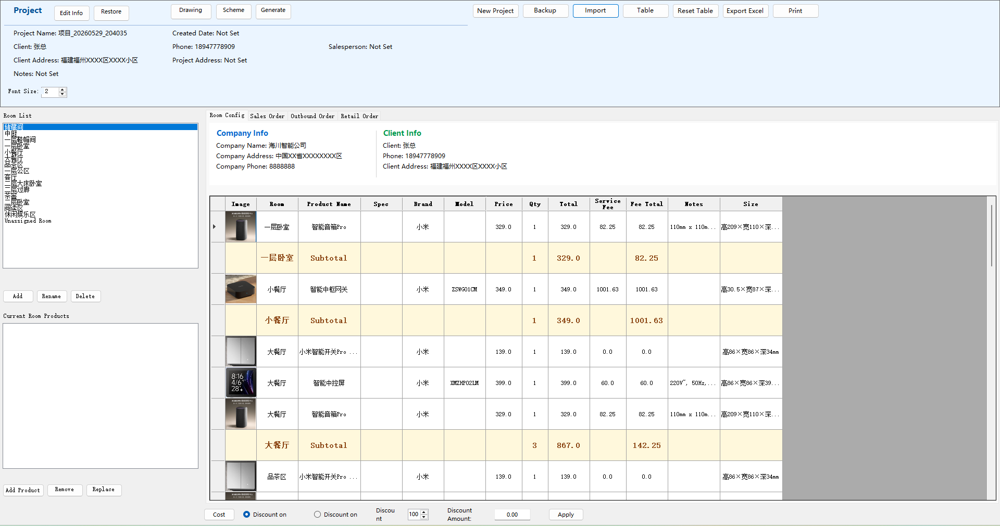
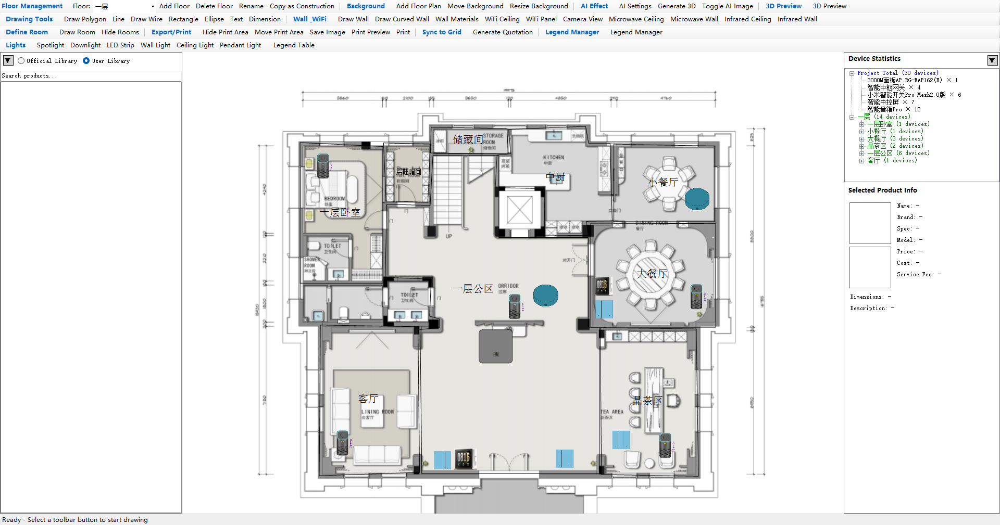
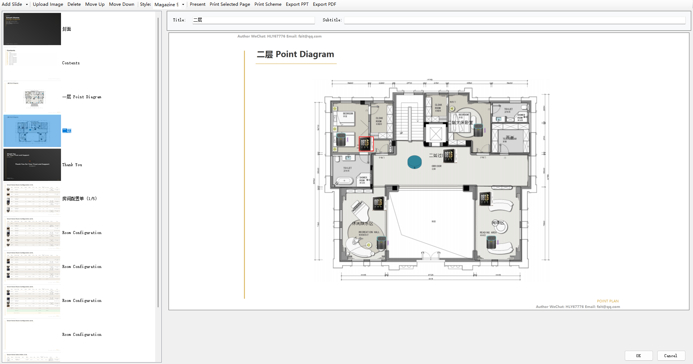
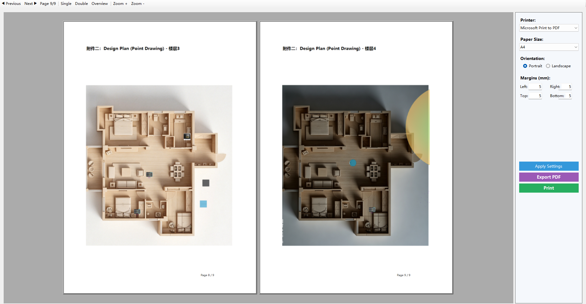

# SmartQuote

**智能家居方案设计软件 / Professional Smart Home Solution Design Software**

  

---

## 🇨🇳 中文

专业的智能家居安装商、经销商方案设计工具，让做方案变得轻松高效。完全离线运行，数据安全存储在本地。

### 功能特性

#### 📐 点位图设计
- 在户型图上自由放置设备图标（灯具、传感器、面板等）
- 支持绘制墙体（直线/弧形）、房间区域、WiFi信号覆盖范围
- 多楼层管理，每层独立设计
- 支持导入PDF底图，精准对齐户型
- 灯具光束角可视化，直观展示照明效果
- 右键菜单快速编辑和删除图元

#### 💡 3D实景预览
- 基于Three.js的3D渲染引擎，实时预览照明效果
- 支持开关灯、调节亮度和色温
- 墙体材质区分（玻璃墙半透明效果）
- 自由旋转、缩放、平移视角

#### 💰 智能报价
- 从产品库快速选品，自动计算报价
- 支持自定义服务费、规格参数
- 成本分析功能，利润一目了然
- 打印预览与专业报价单输出

#### 📄 方案设计
- 多页幻灯片式方案展示
- 支持多种风格模板
- 全屏演示模式，适合客户汇报
- 导出为PPT、PDF、图片等多种格式

#### 🔧 更多功能
- 产品数据库管理，支持自定义品牌和规格
- Excel数据导入，快速建立产品库
- 自动保存与项目备份，数据永不丢失
- 中英文双语界面，支持语言切换

### 截图预览

| 主界面 | 点位图设计 |
|:---:|:---:|
|  |  |

| 智能报价 | 方案设计 |
|:---:|:---:|
|  |  |

### 下载安装

1. 前往 [Releases](https://github.com/Benjamin-LY777/SmartQuote/releases) 下载最新版本
2. 解压 zip 文件
3. 运行 `SmartQuote.exe` 即可使用
4. 首次使用为免费体验版（带水印），联系作者获取激活码可解锁完整功能

### 系统要求

- Windows 10/11 (x86/x64)
- .NET Framework 4.8（Win10/11 已预装）
- WebView2 Runtime（Win10/11 已预装）

---

## 🇬🇧 English

Professional solution design tool for smart home installers and dealers, making proposal creation easy and efficient. Fully offline, data stored securely on your device.

### Features

#### 📐 Floor Plan Design
- Place device icons freely on floor plans (lights, sensors, panels, etc.)
- Draw walls (straight/arc), room areas, WiFi signal coverage
- Multi-floor management with independent designs per floor
- Import PDF floor plans for precise alignment
- Light beam angle visualization for lighting effects
- Right-click context menu for quick editing and deletion

#### 💡 3D Realistic Preview
- Three.js-powered 3D rendering engine with real-time lighting
- Toggle lights on/off, adjust brightness and color temperature
- Wall material differentiation (semi-transparent glass walls)
- Free rotation, zoom, and pan controls

#### 💰 Smart Quotation
- Quick product selection from database with auto-calculated quotes
- Customizable service fees and specifications
- Cost analysis for clear profit visibility
- Print preview and professional quote output

#### 📄 Proposal Design
- Multi-slide presentation format
- Multiple style templates supported
- Full-screen demo mode for client presentations
- Export to PPT, PDF, images and more

#### 🔧 More Features
- Product database management with custom brands and specs
- Excel data import for quick product library setup
- Auto-save and project backup — never lose your data
- Bilingual interface (Chinese/English) with language switching

### Screenshots

| Main Interface | Floor Plan Design |
|:---:|:---:|
|  |  |

| Smart Quotation | Proposal Design |
|:---:|:---:|
|  |  |

### Download & Install

1. Go to [Releases](https://github.com/Benjamin-LY777/SmartQuote/releases) to download the latest version
2. Extract the zip file
3. Run `SmartQuote.exe` to start
4. Free trial version (with watermark) — contact the author for an activation code to unlock full features

### System Requirements

- Windows 10/11 (x86/x64)
- .NET Framework 4.8 (pre-installed on Win10/11)
- WebView2 Runtime (pre-installed on Win10/11)

---

## License

© 2026 Benjamin_LY. All rights reserved.